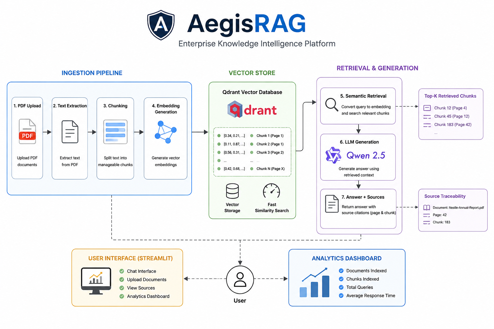
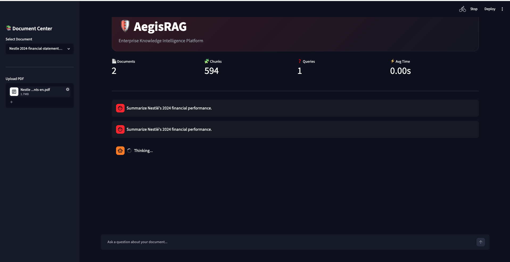
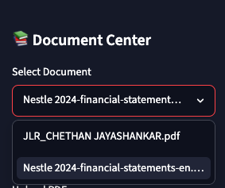
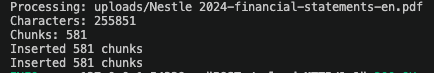

# 🛡️ AegisRAG

**Enterprise Knowledge Intelligence Platform**

AegisRAG is a Retrieval-Augmented Generation (RAG) platform that enables users to upload, index, search, and interact with PDF documents using semantic search and local Large Language Models (LLMs).

Built using **FastAPI**, **Qdrant**, **Qwen 2.5**, and **Streamlit**, AegisRAG provides source-grounded answers with page-level traceability and retrieval analytics.

---

## 🚀 Features

* 📄 PDF Upload & Ingestion
* 🔍 Semantic Search using Vector Embeddings
* 🧠 Local LLM Inference with Qwen 2.5 (Ollama)
* 📚 Source-Grounded Responses
* 📍 Page-Level & Chunk-Level Traceability
* 📊 Analytics Dashboard
* 🗂️ Multi-Document Support
* 🔐 Encrypted PDF Support
* ⚡ Fast Retrieval using Qdrant Vector Database
* 🎨 Modern Interactive Streamlit UI

---

## 🏗️ Architecture



### Workflow

PDF Upload
↓
Text Extraction
↓
Chunking
↓
Embedding Generation
↓
Qdrant Vector Store
↓
Semantic Retrieval
↓
Qwen 2.5
↓
Answer + Source Citations

---

## 🖥️ Dashboard



AegisRAG provides a real-time analytics dashboard showing:

* Documents Indexed
* Chunks Indexed
* Query Count
* Average Response Time

---

## 📄 Enterprise Document Processing



Supports:

* Resumes
* Research Papers
* Annual Reports
* Financial Statements
* Internal Knowledge Documents

---

## ❓ Question Answering


Example Queries:

* What skills does the candidate have?
* Summarize Nestlé's 2024 financial performance.
* What risks were identified in the annual report?
* Extract key business insights.

---

## 📚 Source Traceability



Every answer is backed by retrieved document chunks.

Example:

📄 Nestle-Annual-Report.pdf

Page: 42

Chunk: 183

This improves transparency and helps users verify AI-generated responses.

---

## 🛠️ Tech Stack

### Backend

* FastAPI
* Python 3.11

### Retrieval Layer

* Qdrant Vector Database
* Sentence Transformers

### LLM

* Qwen 2.5
* Ollama

### Frontend

* Streamlit

### Infrastructure

* Docker
* Docker Compose

---

## 📂 Project Structure

```text
Aegis-RAG/
│
├── app/
│   ├── api/
│   ├── ingestion/
│   ├── llm/
│   ├── vectorstore/
│
├── frontend/
│
├── screenshots/
│
├── Dockerfile.fastapi
├── Dockerfile.streamlit
├── docker-compose.yml
├── requirements.txt
└── README.md
```

## ⚙️ Local Setup

### Clone Repository

```bash
git clone https://github.com/Chethancj/Aegis-RAG.git

cd Aegis-RAG
```

### Create Virtual Environment

```bash
python -m venv venv

source venv/bin/activate
```

### Install Dependencies

```bash
pip install -r requirements.txt
```

### Start Qdrant

```bash
docker run -d \
-p 6333:6333 \
--name qdrant \
qdrant/qdrant
```

### Start Ollama

```bash
ollama serve
```

Pull Qwen:

```bash
ollama pull qwen2.5:3b
```

### Start FastAPI

```bash
uvicorn app.main:app --reload
```

### Start Streamlit

```bash
streamlit run frontend/app.py
```

---

## 📈 Future Roadmap

* User Authentication
* Team Workspaces
* Multi-Collection Search
* Retrieval Evaluation Metrics
* Cloud Deployment
* Chat History Persistence
* Hybrid Search (Keyword + Vector)
* Document Comparison

---

## 🎯 Key Learnings

This project demonstrates:

* Retrieval-Augmented Generation (RAG)
* Semantic Search
* Vector Databases
* LLM Integration
* Source Grounding
* AI System Design
* Full-Stack AI Engineering

---

## 👨‍💻 Author

**Chethan Jayashankar**

LinkedIn:
https://www.linkedin.com/in/chethan-jayashankar-57a8122b8

GitHub:
https://github.com/Chethancj

---

## ⭐ If you found this project interesting

Consider giving it a star on GitHub.

